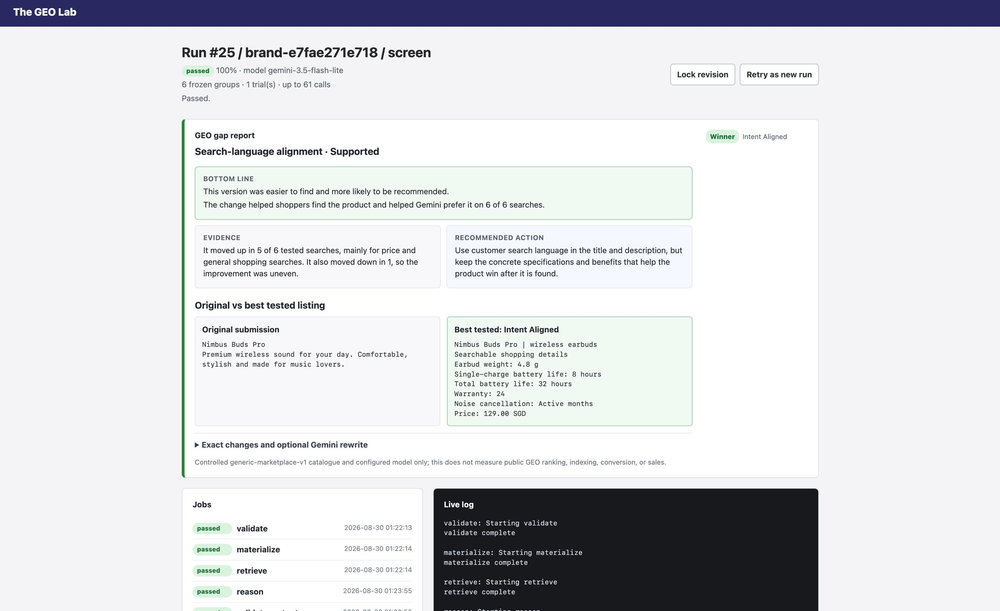
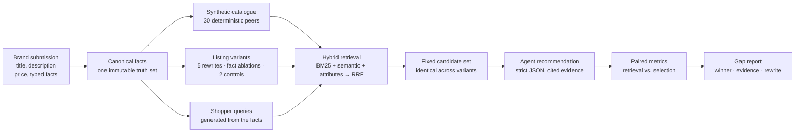
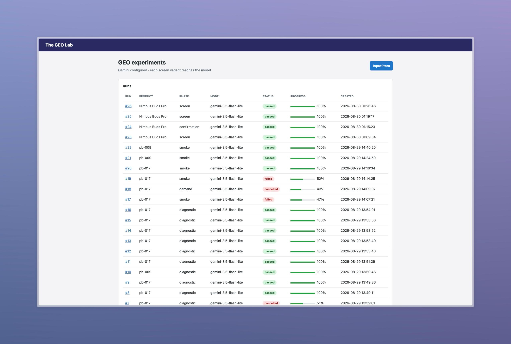

# 🛒 The GEO Lab

**Generative Engine Optimization for product listings, measured rather than guessed.**

[](./pyproject.toml)
[](./src/intenttwin/web.py)
[](./migrations/001_initial.sql)
[](./tests)
[](./LICENSE)

Paste a product listing. The GEO Lab rewrites it several ways, drops every version into the same
synthetic marketplace against the same 30 competitors, asks a shopping agent on every version of every
query which product it would recommend, then reports which rewrite won and which queries moved.



> [!NOTE]
> Every number comes from a controlled catalogue and one configured model. The lab measures whether a
> listing change helps an AI assistant find and choose the product **inside that experiment**. It does
> not measure public ChatGPT visibility, search indexing, conversions, or sales.

## Table of contents

- [The gap we are solving](#the-gap-we-are-solving)
- [How it works](#how-it-works)
- [Quick start](#quick-start)
- [Anatomy of a run](#anatomy-of-a-run)
- [What gets measured](#what-gets-measured)
- [Why the results are trustworthy](#why-the-results-are-trustworthy)
- [Beyond one category](#beyond-one-category)
- [Adoption path for a brand](#adoption-path-for-a-brand)
- [Development](#development)
- [License](#license)
- [Limitations](#limitations)

## The gap we are solving

Shoppers have stopped typing `running shoes size 10`. They ask for *lightweight shoes under S$200 for
a humid half marathon*. An assistant answering that question does two separate things, and a listing
can fail at either one:

1. **Retrieval.** The listing has to survive a search over the catalogue and enter the small candidate
   set the model actually reads. Vocabulary and explicit attributes decide this.
2. **Selection.** Once inside that set, the listing has to beat competitors that the model can read
   just as easily. Evidence the model can cite decides this.

Brands have no way to tell which half is broken. Rewriting a description and watching sales tells you
nothing, because traffic, price, season, and the assistant's own variance all move at once. The GEO
Lab holds everything constant except the listing text, so the difference that remains is the content.

## How it works



Everything except the listing body is frozen inside a run. The competitors, the query set, the
candidate list, and the candidate ordering are byte-identical across variants; only the product under
test changes. That is what makes a difference in the metrics attributable to the content.

| Stage | What happens |
| --- | --- |
| `validate` | Every generated query must be satisfiable by the submitted facts, or the run stops. |
| `materialize` | Renders each variant, verifies competitors were untouched, builds a per-variant FTS5 index. |
| `retrieve` | Runs three ranking channels, fuses them with reciprocal rank fusion, applies hard constraints. |
| `reason` | Sends one recommendation call per query and variant, paced and retried against provider limits. |
| `validate_outputs` | Rejects invented products, constraint violations, and uncited or unexposed evidence. |
| `analyze` | Computes paired deltas, writes `metrics.json`, `metrics.csv`, and `gap_report.json`. |

## Quick start

**Requirements:** Python 3.11+, [uv](https://docs.astral.sh/uv/), and one OpenAI-compatible endpoint
that supports strict structured output.

```bash
uv sync --extra dev
cp .env.example .env
uv run intenttwin
```

Point `.env` at your provider. The example below uses Gemini's OpenAI-compatible surface:

```bash
INTENTTWIN_LLM_URL=https://generativelanguage.googleapis.com/v1beta/openai/chat/completions
INTENTTWIN_LLM_MODEL=your_model_id_here
INTENTTWIN_LLM_API_KEY=your_api_key_here
INTENTTWIN_LLM_MIN_INTERVAL=4.2
```

Open the printed localhost URL and choose **Input item**. Six sample listings are one click away,
including a matched pair (the same earbuds described well and described vaguely), which is the
fastest way to see the lab separate content quality from product quality.

> [!TIP]
> `INTENTTWIN_LLM_MIN_INTERVAL` is the seconds between calls; 4.2 keeps free Gemini tiers inside quota.
> On a 429 the run keeps the provider's own message, honours `Retry-After`, backs off, and stays
> cancellable. Tune `INTENTTWIN_LLM_RATE_LIMIT_RETRIES` and `INTENTTWIN_LLM_RATE_LIMIT_BASE_DELAY`
> only if your quota needs different behaviour.

Runs survive a refresh in `intenttwin.db`, and artifacts land in `data/artifacts/<run-id>/`. Deleting
the database resets the lab; export anything you want to keep first.



## Anatomy of a run

A submission becomes ten listings that all state the truth, plus two that exist to catch lying
instruments.

| Variant | What it tests |
| --- | --- |
| `original` | The submitted listing. Baseline for every paired comparison. |
| `normalized_same_facts` | Same facts, structured labels. Isolates formatting from content. |
| `complete_specs` | Every verified fact made explicit. |
| `benefit_led` | Verified specs under customer-facing labels. |
| `intent_aligned` | Category and search vocabulary in the title line. |
| `single_fact_*` | The original plus exactly one missing fact. Prices a single omission. |
| `identity_control` | Byte-identical copy of the original. Any movement here is model noise, not signal. |
| `misleading_control` | One inflated number. The pipeline must flag it on every attempt. |

The screen phase runs 6 generated queries across every variant, costing at most 60 recommendation
calls plus one summary call. The two strongest variants are then promoted into a confirmation phase
on 12 held-out queries they have never seen, against the original and the identity control: 48 calls
plus a summary. A variant that only won by fitting the screen queries does not survive that.

## What gets measured

Retrieval and selection are reported separately, and never merged into one score that hides a
disagreement between them.

| Metric | Question it answers |
| --- | --- |
| Retrieval MRR / top 3 | Did the rewrite make the product easier to surface at all? |
| Agent top 1 / top 3 | Once every competitor was equally visible, was it chosen? |
| Valid attempts | Did responses obey the schema, the candidate set, and the hard constraints? |
| Unsupported template claims | Did the pipeline catch the deliberately false control? |

The two can move in opposite directions, and that is the useful case. A rewrite that lifts retrieval
while sinking selection means the wording now matches how shoppers search, but the listing loses the
comparison once the model reads it. The gap report says which of the two happened, names the queries
that moved, and gives one recommended action in plain language.

## Why the results are trustworthy

- **Nothing but the listing changes.** Competitor presentations are hashed and re-checked; a run fails
  if any of them drifts.
- **Position is rotated.** The product under test moves through the candidate list across queries and
  trials, so ordering bias cannot masquerade as a content win.
- **The null control has to come back null.** Identical text scoring differently is reported as model
  variance, which is the floor any real effect has to clear.
- **The lying control has to be caught.** The misleading variant can never win, and its typed mismatch
  is reported as an unsupported claim on every affected output.
- **Model claims are checked against facts.** Recommendations may only cite evidence IDs exposed in
  the listing they read, and the suggested rewrite is rejected if it contains a number the brand never
  submitted.
- **Runs are reproducible.** Manifests, content hashes, and a fixed analysis seed pin each run; an
  identical request reuses its cached observation instead of paying for it twice.

## Beyond one category

Nothing in the pipeline knows what a power bank is. A submission is a name, a category string, a
price, and typed attributes with a comparison direction (`higher`, `lower`, `exact`). From those,
competitors, queries, constraints, and rewrites are all derived:

- **Competitors** scale each numeric fact by a deterministic factor and vary which facts each peer
  discloses, producing a plausible spread in any category.
- **Queries** are built from the attributes themselves, so a `10% niacinamide` fact yields a
  concentration query the same way `28 L` yields a capacity one.
- **Constraints** follow the comparison direction, which is what lets a hard filter work on a fact the
  system has never seen before.

The bundled samples run across earbuds, running shoes, an office chair, a face serum, and a travel
backpack without a single category-specific branch.

## Adoption path for a brand

Integration is a listing, not a migration. There is no SDK to embed and no traffic to redirect.

1. **Paste one listing** into the form, or `POST /runs` with the same fields from a catalogue export.
2. **Read the gap report**: winner, evidence, and the exact facts the winning version made explicit.
3. **Ship the rewrite** to your existing marketplace listing. Only content changes.
4. **Lock the revision** and re-run when the catalogue moves, comparing against the locked baseline.

Results are on disk as JSON and CSV per run, so a catalogue team can batch submissions through the
same endpoint the dashboard uses and diff the reports.

## Development

```bash
uv run pytest              # unit and full-pipeline tests with a recorded provider
uv run ruff check .        # lint
uv run python scripts/run_smoke.py   # end-to-end run against the configured provider
```

| Path | Contents |
| --- | --- |
| `src/intenttwin/core.py` | Hashing, treatment rendering, retrieval channels, paired metrics. |
| `src/intenttwin/geo.py` | Submission parsing, query and competitor generation, variants, validation. |
| `src/intenttwin/pipeline.py` | Staged worker, provider pacing, gap report construction. |
| `src/intenttwin/reasoning.py` | Structured-output calls and provider error handling. |
| `src/intenttwin/web.py` | FastAPI routes, JSON status API, metric presentation. |
| `migrations/001_initial.sql` | The full schema. |

The dashboard is server-rendered HTML with one small script that polls a status endpoint every second.
No build step, no bundler, no framework.

## Limitations

- The catalogue is synthetic and the competitors are generated, so absolute rates are not market share.
- The semantic channel is a pinned deterministic projection rather than a downloaded sentence encoder,
  which trades embedding quality for reproducibility.
- Six screen queries and one trial per variant make the screen directional; the held-out confirmation
  phase exists because the screen alone is not enough evidence.
- Results are descriptive. Sample sizes, margins, and decision rules would need to be fixed in advance
  before any run could be called confirmatory.

## License

Released under the [MIT License](./LICENSE).
